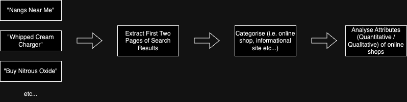

# Search Query Selection Protocol 

## Context
In order to extract search results which reflect the true web market for nitrous oxide sales in Australia, we first must identify which nitrous oxide related search terms: 

1. Are most commonly queried in Australia 
2. Yield webpages which sell nitrous oxide (rather than simply provide information regarding nitrous oxide)

## Methods
This method is based on the findings that **only 0.44% of Google Search users reach the second page of Google Search results**. Hence, to emulate the pages that users will actually interact with when using online search engines, results have been limited to the first page.

## Step 1: determining what search terms to use
For this step, the "Google Trends Narratives" tool was used to explore for terms related to the master query "nitrous oxide".

A recursive depth of 2 was used, with region set to "Australia: all" and time interval of 12 months. Data was used since January 1 2020. 

